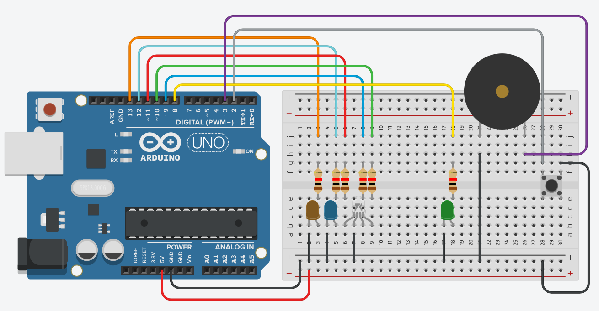
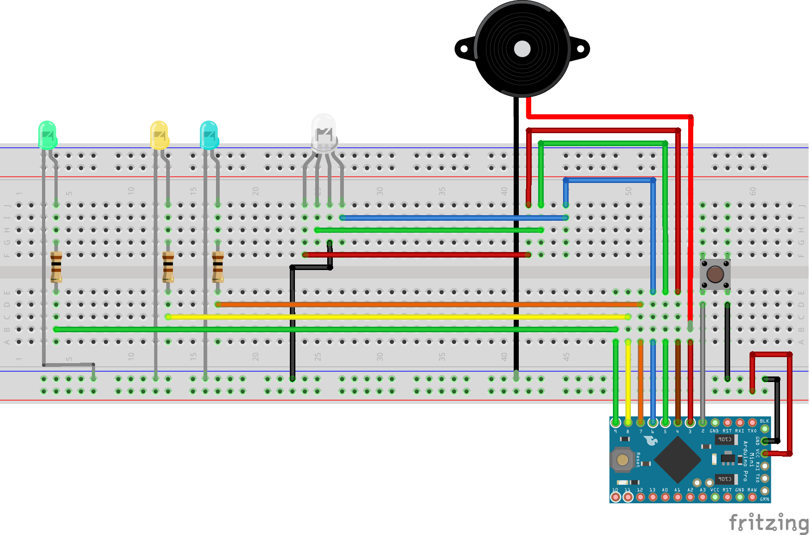

# Mod cambio de región sin interruptores para Mega Drive II
Control de cambio de region (Europa, USA, Japon), o de frecuencia (50/60Hz) de la Mega Drive 2, utilizando unicamente el boton de reset de la misma consola. Segun el tiempo que se pulsa el boton:
  - **Menos de 1 segundo:** Reset
  - **Entre 1 y 2 segundos:** Cambio entre 50Hz y 60Hz
  - **Mas de 2 segundos:** Cambio ciclico de Region: EUR->USA->JAP->EUR

## Dependencias

### Librería LowPower
Debemos descargarla de su proyecto oficial en Github ([rocketscream/Low-Power](https://github.com/rocketscream/Low-Power)) y situarla en el directorio de librerías (lib) dentro de la carpeta LowPower

## Regiones diponibles

### Europa
Esta es la region PAL europea de la Sega Mega Drive, se corresponde a la combinacion de refresco a **50Hz** e idioma **no japonés**. Se puede llegar a ella mediante cambios de región (pulsacion de 2 o más segundos) o cambiando la frecuencia desde la región _USA_

### Japón
Es la región de las Mega Drive asiáticas (PAL Japón), se corresponde a la combinación de refresco a **60Hz** e idioma **japonés**. Se puede llegar a ella mediante cambios de región (pulsacion de 2 o más segundos) o cambiando la frecuencia desde la región _custom_

### USA
Es la región de las Mega Drive americanas (NTSC), se corresponde a la combinación de refresco a **60Hz** e idioma **no japonés**. Se puede llegar a ella mediante cambios de región (pulsacion de 2 o más segundos) o cambiando la frecuencia desde la región _Europa_

### Región personalizada o custom
No es una región existente en las consolas vendidas, es el resultdo de combinar el refresco a **50Hz** e idioma **japonés**. Solamente se puede llegar a ella cambiando la frecuencia desde la región _japonesa_, pero no desde el cambio de región, ya que no es una región real de la consola. 

**AVISO:** Al no ser una región real de la consola, es posible que se produzcan errores en algunos juegos. Solo se incluye porque es accesible mediante el mod con interruptores

## Led de Mega Drive
Al reemplazar el led de la Mega Drive II por un LED RGB, este nos indicará el estado de configuración de la consola, según los diferentes colores

### Azul
Se corresponde con la región **Europa**, nos inidca que la consola está configurada como
  - **Frecuencia de refresco:** 50Hz
  - **Idioma**: No japonés

### Magenta
Se corresponde con la región **personalizada** o **custom**, nos inidca que la consola está configurada como
  - **Frecuencia de refresco:** 50Hz
  - **Idioma**: Japonés

### Rojo
Se corresponde con la región **Japón**, nos inidca que la consola está configurada como
  - **Frecuencia de refresco:** 60Hz
  - **Idioma**: Japonés

### Verde
Se corresponde con la región **USA**, nos inidca que la consola está configurada como
  - **Frecuencia de refresco:** 60Hz
  - **Idioma**: No japonés
  
## Avisos acústicos
Para facilitar el control del tiempo de pulsación del botón de reset, se ha añadido al diseño un buzzer pasivo, para emitir pitidos.

Al encenderse emite un pitido agudo, que sirve como referencia para distinguir los dos posibles tipos de pitido.

### Pitido más grave que el de refenrecia
Este pitido indica que se ha llegado a la pulsación "mínima" para hacer únicamente el cambio de frecuencia de refresco

### Pitido igual al de referencia
Este pitido indica que se ha llegado a la pulsación "mínima" para hacer el cambio de región

## Código en arduino
Para que el arduino arranque al instante y evitar posibles conexiones erroneas (como que resetee la consola en el arranque), no podemos cargar el software de la forma habiual, sino que tendremos que usar un programador. En el caso de mi Mega Drive, se ha hecho con un Arduino Pro Mini (ATMega328P) y un programador USBasp v2.0

### Pruebas Arduino Uno
Las pruebas se han hecho con un Arduino Uno R3, usando LEDS para momitorizar los estados de los pines (el de la señal de reset a la consola se iluminará de fomra muy leve). Se puede ver el diagrama:

### Pruebas con Arduino Pro Mini
Para facilitar el montaje en la consola, utilizando un Arduino Pro Mini, se cambiaron las conexiones de los cables, de forma que quedasen mejor agrupados, facilitando el pase de los mismos a la zona de montarje del Arduino:

